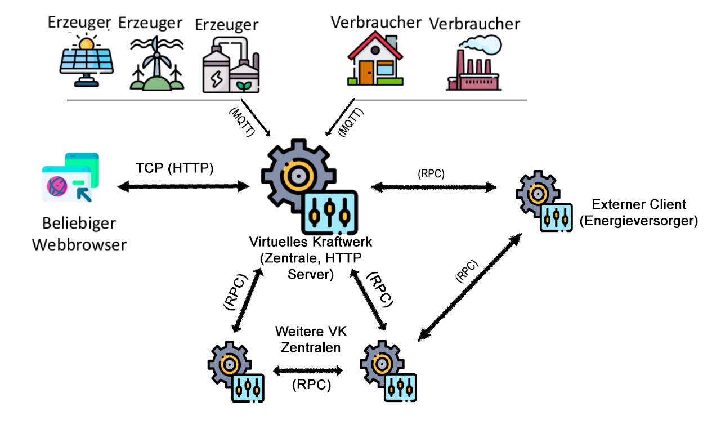
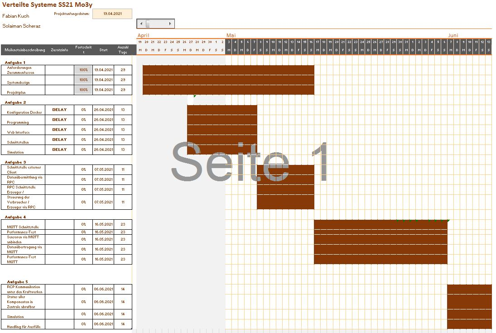

# Verteilte Systeme - Burchard

Das Repo für das Modul Verteilte Systeme im Sommer Semester 2021.

# Anforderungsanalyse:
	
## Aufgabe 2:

- Verbraucher / Erzeuger werden simuliert
	- Verbraucher:
		- Haushalt
		- Industrie
	- Erzeuger (besitzen Maximalkapazität):
		- Windkraftwerk (produziert keinen Strom bei Windstille)
		- Solarkraftwerk (produziert keinen Strom bei Nacht)
		- Kohlekraftwerk
	- Einzelne Komponenten können ausfallen -> kein Strom
	- Senden Informationen über UDP an Zentrale:
		- Art des Teilnehmers (E / V)
		- Eindeutige ID oder Name
		- Aktuelle Strommenge (kW)

- Zentralsteuerung eines virtuellen Kraftwerks simulieren:
	- Binhaltet einen HTTP-Server
		- Dieser liefert über eine REST-API Informationen über die Erzeuger / Verbraucher, deren Verbrauch und der Verbrauchshistore (jeweils mit einer eigenen URI)
		- Auch werden die erhaltenden Informationen der Erzeuger / Verbraucher auf der Konsole dargestellt

- HTTP-Server:
	- ohne vorhandene Bibliotheken implementieren
	- mindestens HTTP GET unterstützen
	- arbeitet mit beliebigen Browsern, protokolliert den User-Agent des Browsers
	- Gleichzeitige Kommunikation mit Erzeugern / Verbrauchern und Klienten
	
## Aufgabe 3:

- Zentralsteuerung übermittelt an externen Client (z.B. übergeordnete Einheit eines großen Energieversorgers):
	- Übermittlung mittels RPC (Apache Thrift oder gRPC/Protobuf)
		- Übermittelt aktuellen Status aller Komponenten des Kraftwerks
		- Übermittelt gesamte Historie aller Komponenten des Kraftwerks
		
- Zentrale besitzt geeignete RPC-Schnittstelle:
	- einzelne Komponenten können eingeschaltet werden
	- einzelne Komponenten können ausgeschaltet werden
	- Leistung bei Erzeugern erhöhen
	
- Erzeuger / Verbraucher benötigen ebenfalls eine RPC-Schnittstelle

## Aufgabe 4

- MQTT Verwendung:
	- Zentrale soll mittels MQTT (Publish / Subscribe) kommunizieren
	- Erzeuger / Verbraucher soll mittels MQTT mit der Zentrale kommunizieren
- Performance-Vergleich, vorher (UDP) / nachher (MQTT)

## Aufgabe 5

- Mehrere Zentralen zusammenschließen
- Client kann jegliche Zentrale nach Erzeuger / Verbraucher Daten abfragen (via RPC)
	- Status aller Komponenten muss in der Zentrale vorhanden sein
	- Fragestellung: Welche Art der Konsistenz muss erreicht werden und wie, damit die Status der Kraftwerke an andere Zentralen verteilt werden kann
- Zufällige simulierte Ausfälle der Zentralen um Ausfallsicherheit des Gesamtsystems zu testen
	- Wie geht der Client damit um
		- Jederzeit konsistente Darstellung des Systemzustands
		- Kann dieses Ziel erreicht werden? Müssen Abstriche gemacht werden?
		- Verwendung von Apache Thrift oder gRPC/Protobuf

# Projektdesign:

# Projektplan:

# Vorinstallationen:
- Apache Maven 3.6.3
- Java 11
- Neuste Docker + Docker Compose Version

# Installation:
1. Clone Repository: https://code.fbi.h-da.de/istfakuch/verteilte-systeme-burchard.git
2. Run Docker Compose File

# Dokumentation :
>[Test Dokumentation](https://code.fbi.h-da.de/istfakuch/verteilte-systeme-burchard/-/blob/master/Test%20Dokumentation.pdf)

# Entwickler:
- Fabian Kuch
- Solaiman Scheraz
